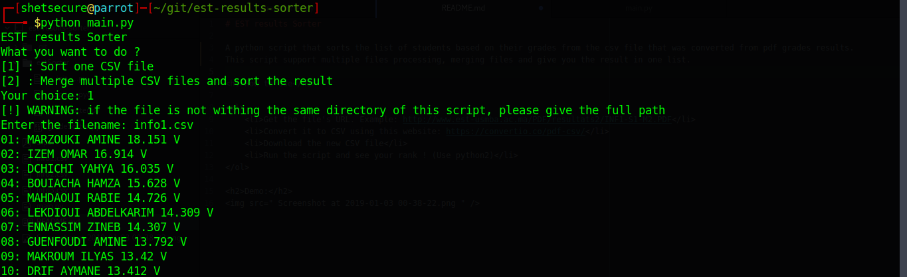
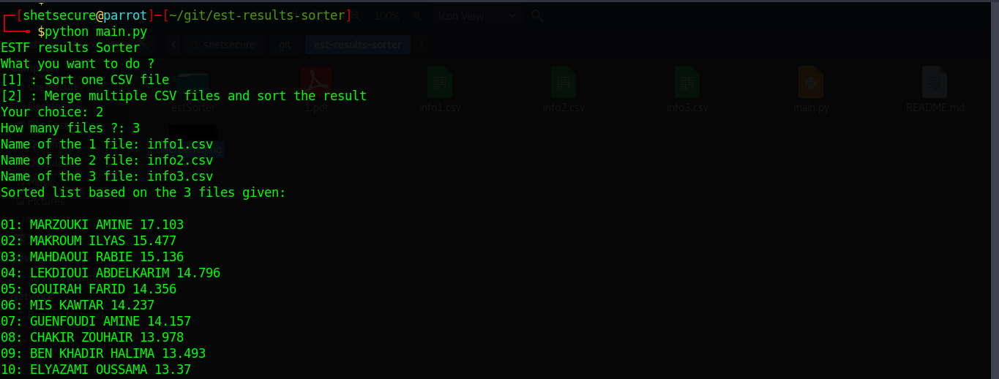

# EST results Sorter

A python script that sorts the list of students based on their grades from the csv file that was converted from pdf grades results.
This script support multiple files processing, merging files and give you the result in one list.

<h1>How to Use</h1>

<ol>
    <li>Get the file's URL (Or Multiple files). Example: http://www.est-usmba.ac.ma/PDF/resultats2/INF1-S1-M2.PDF</li>
    <li>Convert it to CSV using this website: https://convertio.co/pdf-csv/</li>
    <li>Download the new CSV file(s)</li>
    <li>Run the script and see your rank ! ( Use python2 )</li>
</ol>

<h2>Demo:</h2>

